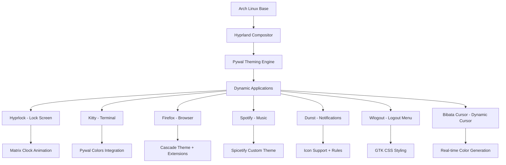

# 📦 Guía Completa de Dependencias

> **Instalación paso a paso de todos los paquetes y herramientas necesarios para el sistema de rice Hyprland + Arch Linux**

## 📋 Índice

- [🏗️ Arquitectura del Sistema](#️-arquitectura-del-sistema)
- [📦 Paquetes Oficiales](#-paquetes-oficiales)
- [🎭 Paquetes AUR](#-paquetes-aur)
- [📱 Herramientas NPM/Cargo](#-herramientas-npmcargo)
- [🔧 Configuraciones Post-Instalación](#-configuraciones-post-instalación)
- [✅ Verificación de Instalación](#-verificación-de-instalación)
- [🚑 Troubleshooting](#-troubleshooting)

## 🏗️ Arquitectura del Sistema



## 📦 Paquetes Oficiales

### 🏠 **Sistema Base Hyprland**

```bash
# Compositor y herramientas base
sudo pacman -S hyprland           # Compositor Wayland principal
sudo pacman -S hyprlock           # Sistema de bloqueo nativo
sudo pacman -S hypridle           # Gestor de inactividad (opcional)
sudo pacman -S xdg-desktop-portal-hyprland  # Portal desktop

# Herramientas de Wayland esenciales
sudo pacman -S wl-clipboard       # Portapapeles para Wayland
sudo pacman -S grim               # Captura de pantalla
sudo pacman -S slurp              # Selector de área de pantalla
sudo pacman -S swappy             # Editor de capturas (opcional)
```

### 🎨 **Sistema de Tematización**

```bash
# Pywal y dependencias de imagen
sudo pacman -S python-pywal      # Generador de paletas de colores
sudo pacman -S python-pillow     # Procesamiento de imágenes
sudo pacman -S imagemagick        # Manipulación de imágenes
sudo pacman -S feh                # Visor de imágenes ligero

# Herramientas de color adicionales
sudo pacman -S python-colorama   # Colores en terminal
sudo pacman -S python-haishoku   # Extracción de colores dominantes
```

### 🖥️ **Aplicaciones de Escritorio**

```bash
# Terminal y shell
sudo pacman -S kitty              # Terminal moderno con GPU acceleration
sudo pacman -S zsh                # Shell avanzado
sudo pacman -S zsh-completions    # Completions para zsh

# Navegador y multimedia
sudo pacman -S firefox            # Navegador web principal
sudo pacman -S mpv                # Reproductor multimedia
sudo pacman -S ffmpeg             # Codecs y conversión multimedia

# Editor de texto
sudo pacman -S neovim             # Editor moderno basado en Vim
sudo pacman -S nodejs             # Runtime para plugins de Neovim
sudo pacman -S npm                # Gestor de paquetes Node.js
```

### 🔔 **Sistema de Notificaciones y Menús**

```bash
# Notificaciones
sudo pacman -S dunst              # Daemon de notificaciones
sudo pacman -S libnotify          # Biblioteca de notificaciones

# Launchers y menús
sudo pacman -S rofi               # Launcher de aplicaciones
sudo pacman -S rofi-wayland       # Versión Wayland de rofi
sudo pacman -S wlogout            # Menú de logout para Wayland

# Iconos y temas
sudo pacman -S papirus-icon-theme # Pack de iconos completo
sudo pacman -S adwaita-icon-theme # Iconos base de GNOME
sudo pacman -S hicolor-icon-theme # Iconos base del sistema
```

### 🛠️ **Herramientas de Desarrollo y Construcción**

```bash
# Compiladores y herramientas
sudo pacman -S base-devel         # Herramientas base de desarrollo
sudo pacman -S rust               # Lenguaje Rust (para ctgen)
sudo pacman -S cargo              # Gestor de paquetes Rust
sudo pacman -S yarn               # Gestor de paquetes alternativo a npm
sudo pacman -S git                # Control de versiones

# Herramientas de archivo y sistema
sudo pacman -S file               # Identificador de tipos de archivo
sudo pacman -S unzip              # Descompresor
sudo pacman -S wget               # Descargador de archivos
sudo pacman -S curl               # Cliente HTTP
```

### 🎵 **Audio y Multimedia**

```bash
# Sistema de audio PipeWire (recomendado para Wayland)
sudo pacman -S pipewire           # Servidor de audio moderno
sudo pacman -S pipewire-pulse     # Compatibilidad con PulseAudio
sudo pacman -S pipewire-alsa      # Compatibilidad con ALSA
sudo pacman -S wireplumber        # Gestor de sesiones PipeWire

# Herramientas de audio
sudo pacman -S pavucontrol        # Control de volumen gráfico
sudo pacman -S pamixer            # Control de volumen CLI
```

### 🖼️ **Fuentes**

```bash
# Fuentes esenciales
sudo pacman -S ttf-jetbrains-mono-nerd  # Fuente principal del sistema
sudo pacman -S ttf-fira-code             # Fuente alternativa con ligaduras
sudo pacman -S noto-fonts                # Fuentes Unicode completas
sudo pacman -S noto-fonts-emoji          # Emojis

# Fuentes adicionales
sudo pacman -S ttf-dejavu                # Fuentes DejaVu
sudo pacman -S ttf-liberation            # Fuentes Liberation
sudo pacman -S adobe-source-code-pro-fonts  # Source Code Pro
```

## 🎭 Paquetes AUR

### 📋 **Preparación del AUR Helper**

```bash
# Instalar paru (recomendado)
cd /tmp
git clone https://aur.archlinux.org/paru.git
cd paru
makepkg -si

# O instalar yay (alternativa)
cd /tmp
git clone https://aur.archlinux.org/yay.git
cd yay
makepkg -si
```

### 🎵 **Spotify y Spicetify**

```bash
# Spotify
paru -S spotify                   # Cliente oficial de Spotify

# Spicetify para personalización
paru -S spicetify-cli             # CLI para personalizar Spotify
paru -S spicetify-marketplace     # Marketplace de temas (opcional)

# Alternativa snap (no recomendada para este setup)
# paru -S snapd
# sudo systemctl enable --now snapd.socket
# sudo snap install spotify
```

### 🖱️ **Herramientas de Cursor**

```bash
# Herramientas específicas para construcción de cursor
paru -S cursor-toolbox            # Incluye ctgen y otras herramientas
# O instalar por separado:
# paru -S ctgen                   # Generador de temas de cursor
```

### 🎨 **Temas y Extensiones**

```bash
# Temas GTK adicionales
paru -S catppuccin-gtk-theme      # Tema Catppuccin para GTK
paru -S nordic-theme              # Tema Nordic

# Iconos adicionales
paru -S tela-icon-theme           # Iconos Tela
paru -S beautyline-icon-theme     # Iconos BeautyLine

# Cursores adicionales (backup)
paru -S capitaine-cursors         # Cursores Capitaine
paru -S breeze-default-cursor-theme  # Cursores Breeze
```

### 🔧 **Herramientas Específicas**

```bash
# Herramientas de desarrollo para el rice
paru -S hyprpicker               # Selector de colores para Hyprland
paru -S hyprshot                 # Herramienta de captura específica

# Herramientas adicionales de Wayland
paru -S wev                      # Event viewer para Wayland
paru -S wtype                    # Simulador de teclas para Wayland
```

## 📱 Herramientas NPM/Cargo

### 📦 **Paquetes NPM**

```bash
# Herramienta principal para cursor
npm install -g cbmp              # Cursor bitmap processor

# Herramientas adicionales útiles
npm install -g live-server       # Servidor web para desarrollo
npm install -g http-server       # Servidor HTTP simple
```

### 🦀 **Paquetes Cargo (Rust)**

```bash
# Generador de cursor (principal)
cargo install ctgen              # Cursor theme generator

# Herramientas adicionales útiles
cargo install fd-find            # Alternativa moderna a find
cargo install ripgrep            # Búsqueda rápida en archivos
cargo install bat                # Visualizador de archivos con sintaxis
cargo install exa                # Alternativa moderna a ls
```

### 🔧 **Verificación de Instalación NPM/Cargo**

```bash
# Verificar instalación
which cbmp                       # Debe mostrar: ~/.local/bin/cbmp o similar
which ctgen                      # Debe mostrar: ~/.cargo/bin/ctgen

# Verificar versiones
cbmp --version                   # Versión de cbmp
ctgen --version                  # Versión de ctgen

# PATH necesarios (agregar a ~/.bashrc o ~/.zshrc si es necesario)
export PATH="$HOME/.local/bin:$PATH"
export PATH="$HOME/.cargo/bin:$PATH"
```

## 🔧 Configuraciones Post-Instalación

### 🎵 **Configuración Spicetify**

```bash
# Dar permisos a Spotify (necesario para modificación)
sudo chmod a+wr /opt/spotify
sudo chmod a+wr /opt/spotify/Apps -R

# Configuración inicial de Spicetify
spicetify config inject_css 1 replace_colors 1 overwrite_assets 1
spicetify backup apply

# Verificar instalación
spicetify -v
spicetify config
```

### 🌐 **Configuración Firefox**

```bash
# Habilitar userChrome.css
# 1. Ir a about:config en Firefox
# 2. Buscar: toolkit.legacyUserProfileCustomizations.stylesheets
# 3. Cambiar a: true

# Crear estructura de directorios si no existe
FIREFOX_PROFILE=$(find ~/.mozilla/firefox -name "*.default-release" -type d)
mkdir -p "$FIREFOX_PROFILE/chrome"
mkdir -p "$FIREFOX_PROFILE/chrome/includes"
```

### 🔊 **Configuración Audio PipeWire**

```bash
# Habilitar y iniciar servicios
systemctl --user enable pipewire.service
systemctl --user enable pipewire-pulse.service
systemctl --user enable wireplumber.service

# Iniciar servicios
systemctl --user start pipewire.service
systemctl --user start pipewire-pulse.service
systemctl --user start wireplumber.service

# Verificar funcionamiento
pactl info  # Debe mostrar "Server Name: pulseaudio (on PipeWire)"
```

### 🖥️ **Configuración Hyprland**

```bash
# Crear directorios de configuración
mkdir -p ~/.config/hypr
mkdir -p ~/.config/hypr/scripts

# Configuración básica inicial (si no existe)
if [ ! -f ~/.config/hypr/hyprland.conf ]; then
cat > ~/.config/hypr/hyprland.conf << 'EOF'
# Configuración básica de Hyprland
monitor=,preferred,auto,1

input {
    kb_layout = es
    follow_mouse = 1
    touchpad {
        natural_scroll = no
    }
    sensitivity = 0
}

general {
    gaps_in = 5
    gaps_out = 20
    border_size = 2
    col.active_border = rgba(33ccffee) rgba(00ff99ee) 45deg
    col.inactive_border = rgba(595959aa)
    layout = dwindle
}

decoration {
    rounding = 10
    blur {
        enabled = true
        size = 3
        passes = 1
    }
    drop_shadow = yes
    shadow_range = 4
    shadow_render_power = 3
    col.shadow = rgba(1a1a1aee)
}

animations {
    enabled = yes
    bezier = myBezier, 0.05, 0.9, 0.1, 1.05
    animation = windows, 1, 7, myBezier
    animation = windowsOut, 1, 7, default, popin 80%
    animation = border, 1, 10, default
    animation = borderangle, 1, 8, default
    animation = fade, 1, 7, default
    animation = workspaces, 1, 6, default
}

# Keybinds básicos
$mainMod = SUPER
bind = $mainMod, Q, exec, kitty
bind = $mainMod, C, killactive,
bind = $mainMod, M, exit,
bind = $mainMod, E, exec, dolphin
bind = $mainMod, V, togglefloating,
bind = $mainMod, R, exec, rofi -show drun
bind = $mainMod, P, pseudo,
bind = $mainMod, J, togglesplit,

# Autostart
exec-once = dunst
EOF
fi
```

## ✅ Verificación de Instalación

### 🧪 **Script de Verificación Automática**

```bash
#!/bin/bash
# ~/Rice/Scripts/verify-dependencies.sh

echo "🔍 Verificando dependencias del sistema..."

# Función para verificar comando
check_command() {
    if command -v "$1" &> /dev/null; then
        echo "✅ $1 - instalado"
        return 0
    else
        echo "❌ $1 - NO instalado"
        return 1
    fi
}

# Función para verificar archivo
check_file() {
    if [ -f "$1" ]; then
        echo "✅ $1 - existe"
        return 0
    else
        echo "❌ $1 - NO existe"
        return 1
    fi
}

# Verificaciones principales
echo "=== Compositor y Sistema Base ==="
check_command hyprland
check_command hyprlock
check_command wlogout
check_command dunst
check_command rofi

echo -e "\n=== Terminal y Herramientas ==="
check_command kitty
check_command zsh
check_command wal  # pywal
check_command grim

echo -e "\n=== Aplicaciones ==="
check_command firefox
check_command spotify
check_command spicetify
check_command nvim

echo -e "\n=== Herramientas de Cursor ==="
check_command cbmp
check_command ctgen
check_command npx
check_command cargo

echo -e "\n=== Audio ==="
check_command pipewire
check_command pactl
check_command pamixer

echo -e "\n=== Archivos de Configuración ==="
check_file ~/.config/hypr/hyprland.conf
check_file ~/.cache/wal/colors.sh
check_file ~/.face

echo -e "\n=== Directorios del Rice ==="
check_file ~/Rice/Scripts/setup_hyprlock.sh
check_file ~/Rice/Wallpapers/imagen_001.png
check_file ~/Rice/Bibata_Cursor/build.toml

echo -e "\n=== Servicios ==="
if systemctl --user is-active pipewire.service &> /dev/null; then
    echo "✅ PipeWire - activo"
else
    echo "❌ PipeWire - inactivo"
fi

if pgrep -x "Hyprland" > /dev/null; then
    echo "✅ Hyprland - ejecutándose"
else
    echo "❌ Hyprland - no ejecutándose"
fi

echo -e "\n🎯 Verificación completada!"
```

### 📋 **Checklist Manual**

#### **Sistema Base** ✅
- [ ] Hyprland funcionando
- [ ] Hyprlock instalado
- [ ] Pywal generando colores
- [ ] Terminal Kitty operativo

#### **Cursor Personalizado** ✅
- [ ] cbmp instalado (npm)
- [ ] ctgen instalado (cargo)
- [ ] Directorio Bibata_Cursor presente
- [ ] Script de actualización ejecutable

#### **Aplicaciones** ✅
- [ ] Firefox con userChrome habilitado
- [ ] Spotify con permisos de escritura
- [ ] Spicetify configurado
- [ ] Dunst funcionando

#### **Audio y Multimedia** ✅
- [ ] PipeWire activo
- [ ] Controles de volumen funcionando
- [ ] Spotify reproduce correctamente

#### **Rice Específico** ✅
- [ ] Directorio ~/Rice/ completo
- [ ] Scripts ejecutables
- [ ] Wallpapers disponibles
- [ ] Avatar de usuario (.face)

## 🚑 Troubleshooting

### ❌ **Problemas de Instalación**

#### **Error: cbmp no se instala**
```bash
# Verificar Node.js y npm
node --version
npm --version

# Reinstalar cbmp
npm uninstall -g cbmp
npm install -g cbmp

# Verificar PATH
echo $PATH | grep -o "$(npm config get prefix)/bin"
```

#### **Error: ctgen no funciona**
```bash
# Verificar Rust y Cargo
rustc --version
cargo --version

# Reinstalar ctgen
cargo uninstall ctgen
cargo install ctgen

# Verificar PATH
echo $PATH | grep -o "$HOME/.cargo/bin"
```

#### **Error: Spicetify no puede modificar Spotify**
```bash
# Verificar permisos
ls -la /opt/spotify/

# Aplicar permisos correctos
sudo chmod a+wr /opt/spotify
sudo chmod a+wr /opt/spotify/Apps -R

# Verificar versión compatible
spicetify -v
spotify --version
```

#### **Error: Firefox userChrome no funciona**
```bash
# Verificar configuración
firefox about:config
# Buscar: toolkit.legacyUserProfileCustomizations.stylesheets
# Debe estar en: true

# Verificar estructura de archivos
ls -la ~/.mozilla/firefox/*/chrome/

# Reiniciar Firefox completamente
killall firefox
firefox
```

### 🔧 **Comandos de Diagnóstico**

```bash
# Estado general del sistema
echo "=== Sistema ==="
uname -a
whoami
echo $XDG_CURRENT_DESKTOP
echo $WAYLAND_DISPLAY

echo -e "\n=== Hyprland ==="
hyprctl version
hyprctl monitors
echo $HYPRLAND_INSTANCE_SIGNATURE

echo -e "\n=== Audio ==="
pactl info
pactl list sinks short

echo -e "\n=== Pywal ==="
wal --version
ls -la ~/.cache/wal/

echo -e "\n=== Cursor ==="
echo $XCURSOR_THEME
echo $XCURSOR_SIZE
ls -la ~/.local/share/icons/

echo -e "\n=== Servicios ==="
systemctl --user status pipewire
systemctl --user status wireplumber
```

### 📋 **Lista de Verificación Rápida**

1. **¿Hyprland funciona?** `hyprctl version`
2. **¿Pywal genera colores?** `wal --version && ls ~/.cache/wal/`
3. **¿Cursor tools están disponibles?** `which cbmp && which ctgen`
4. **¿Spicetify funciona?** `spicetify config`
5. **¿Firefox permite userChrome?** Verificar about:config
6. **¿Audio funciona?** `pactl info`
7. **¿Scripts son ejecutables?** `ls -la ~/Rice/Scripts/`

---

**💡 Consejo:** Guarda este archivo como referencia y ejecuta las verificaciones periódicamente para mantener el sistema funcionando correctamente.

---

## 📚 Referencias Útiles

### 📖 **Documentación Oficial**
- [Arch Linux Installation Guide](https://wiki.archlinux.org/title/Installation_guide)
- [Hyprland Documentation](https://wiki.hyprland.org/)
- [Pywal GitHub](https://github.com/dylanaraps/pywal)
- [Spicetify Documentation](https://spicetify.app/docs/getting-started)

### 🛠️ **Herramientas de Desarrollo**
- [Cursor Toolbox](https://github.com/ful1e5/cursor-toolbox)
- [Bibata Cursor](https://github.com/ful1e5/Bibata_Cursor)
- [Firefox Cascade Theme](https://github.com/andreasgrafen/cascade)

---

**Creado por [hen-x](https://github.com/hen-x) • Última actualización: $(date)**
