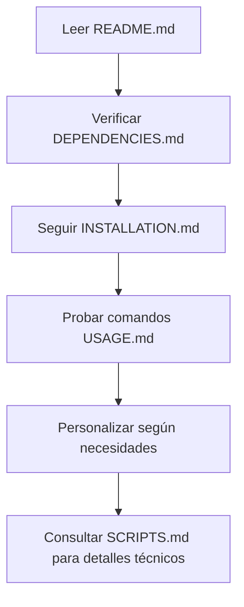
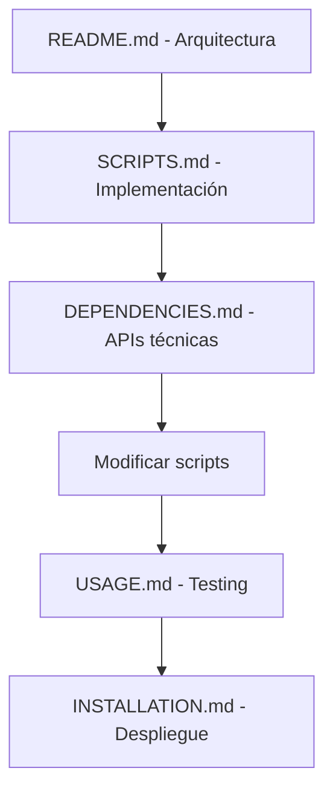
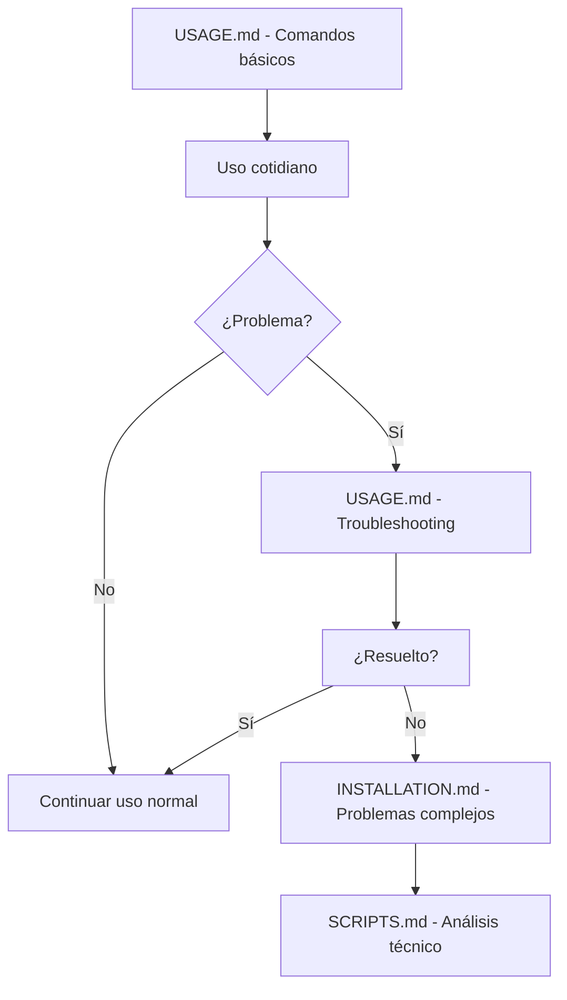

# 📚 Índice de Documentación - Sistema Rice Hyprland + Arch Linux

> **Guía completa y navegación de toda la documentación del sistema**

## 🎯 **Resumen del Sistema**

Este es un sistema de rice completo para **Hyprland + Arch Linux** que incluye:

- 🎨 **Tematización automática** con pywal
- 🔒 **Sistema de bloqueo Matrix** con reloj de palabras
- 🖱️ **Cursor dinámico** que se adapta a los colores
- 📱 **20+ scripts automatizados** para todas las aplicaciones
- 🌈 **Sincronización global** de colores en tiempo real

## 📋 **Documentación Disponible**

### 📖 **Documentos Principales**

| Archivo | Propósito | Audiencia | Tiempo de Lectura |
|---------|-----------|-----------|-------------------|
| **[README.md](README.md)** | Visión general completa del sistema | Todos los usuarios | 15-20 min |
| **[DEPENDENCIES.md](DEPENDENCIES.md)** | Guía detallada de dependencias | Instaladores/Administradores | 10-15 min |
| **[INSTALLATION.md](INSTALLATION.md)** | Instalación paso a paso | Nuevos usuarios | 30-45 min |
| **[SCRIPTS.md](SCRIPTS.md)** | Documentación técnica de scripts | Desarrolladores/Power users | 20-30 min |
| **[USAGE.md](USAGE.md)** | Guía de uso diario | Usuarios cotidianos | 15-20 min |

### 🗂️ **Estructura de la Documentación**

```
📁 Documentación del Sistema Rice
├── 📄 README.md                    # 👥 ENTRADA PRINCIPAL
│   ├── ✨ Características completas
│   ├── 🖼️ Capturas de pantalla
│   ├── 📦 Resumen de dependencias
│   ├── ⚡ Instalación express
│   ├── 🎨 Componentes temáticos
│   └── 🎯 Personalización avanzada
│
├── 📄 DEPENDENCIES.md              # 🔧 DEPENDENCIAS Y PAQUETES
│   ├── 🏗️ Arquitectura del sistema
│   ├── 📦 Paquetes oficiales (pacman)
│   ├── 🎭 Paquetes AUR (paru/yay)
│   ├── 📱 Herramientas NPM/Cargo
│   ├── 🔧 Configuraciones post-instalación
│   └── ✅ Scripts de verificación
│
├── 📄 INSTALLATION.md              # 🚀 INSTALACIÓN COMPLETA
│   ├── ⚡ Instalación express (15 min)
│   ├── 🔧 Instalación detallada paso a paso
│   ├── 🎨 Configuración inicial
│   ├── 🧪 Verificación y testing
│   ├── 📱 Post-instalación
│   └── 🚑 Resolución de problemas
│
├── 📄 SCRIPTS.md                   # 🔧 DOCUMENTACIÓN TÉCNICA
│   ├── 🏗️ Arquitectura de scripts
│   ├── 🔒 Sistema de bloqueo (5 scripts)
│   ├── 🖱️ Cursor dinámico (1 script complejo)
│   ├── 🎨 Tematización (2 scripts)
│   ├── 📱 Aplicaciones (11 scripts)
│   ├── 🧪 Verificación (1+ scripts)
│   └── 📚 API y funciones comunes
│
├── 📄 USAGE.md                     # 🚀 USO DIARIO
│   ├── ⚡ Comandos esenciales
│   ├── 🎨 Gestión de temas y wallpapers
│   ├── 🖱️ Gestión del cursor
│   ├── 📱 Gestión de aplicaciones
│   ├── 🔒 Sistema de bloqueo
│   ├── 🔧 Mantenimiento del sistema
│   ├── 🚑 Solución de problemas
│   └── 📚 Workflows recomendados
│
└── 📄 DOCUMENTATION_INDEX.md       # 📚 ESTE ARCHIVO
    └── 🗺️ Navegación y resumen completo
```

## 🎯 **Guía de Navegación por Caso de Uso**

### 🆕 **Nuevo Usuario - Primera Vez**

**Ruta recomendada:**
1. 📖 **[README.md](README.md)** - Entender qué es el sistema
2. 📦 **[DEPENDENCIES.md](DEPENDENCIES.md)** - Verificar y instalar dependencias
3. 🚀 **[INSTALLATION.md](INSTALLATION.md)** - Instalar paso a paso
4. 🎯 **[USAGE.md](USAGE.md)** - Aprender uso básico

**Tiempo estimado:** 2-3 horas para instalación completa

### 👨‍💻 **Usuario Experimentado - Instalación Rápida**

**Ruta recomendada:**
1. 📖 **[README.md#instalación-express](README.md#-instalación-express-15-minutos)** - Comandos rápidos
2. 📦 **[DEPENDENCIES.md#instalación-express](DEPENDENCIES.md#instalación-express)** - Dependencias resumidas
3. 🎯 **[USAGE.md#comandos-esenciales](USAGE.md#-comandos-esenciales)** - Uso inmediato

**Tiempo estimado:** 15-30 minutos

### 🔧 **Desarrollador/Personalización**

**Ruta recomendada:**
1. 📖 **[README.md](README.md)** - Visión arquitectural
2. 🔧 **[SCRIPTS.md](SCRIPTS.md)** - Documentación técnica completa
3. 🎯 **[USAGE.md#personalización-avanzada](USAGE.md#️-personalización-avanzada)** - Customización
4. 📦 **[DEPENDENCIES.md#api-y-funciones](DEPENDENCIES.md#api-y-funciones-comunes)** - Referencias técnicas

**Tiempo estimado:** 1-2 horas para entender completamente

### 🔧 **Mantenimiento y Troubleshooting**

**Ruta recomendada:**
1. 🎯 **[USAGE.md#mantenimiento](USAGE.md#-mantenimiento-del-sistema)** - Rutinas de mantenimiento
2. 🎯 **[USAGE.md#solución-de-problemas](USAGE.md#-solución-de-problemas-comunes)** - Problemas comunes
3. 🚀 **[INSTALLATION.md#troubleshooting](INSTALLATION.md#-resolución-de-problemas)** - Problemas de instalación
4. 🔧 **[SCRIPTS.md#verificación](SCRIPTS.md#-scripts-de-verificación)** - Scripts de diagnóstico

**Tiempo estimado:** 15-30 minutos por problema

## 🗺️ **Mapa de Contenidos por Temas**

### 🎨 **Tematización y Colores**

| Tema | Ubicación | Detalle |
|------|-----------|---------|
| **Conceptos básicos** | [README.md#tematización](README.md#-tematización-automática) | Cómo funciona pywal |
| **Instalación pywal** | [DEPENDENCIES.md#pywal](DEPENDENCIES.md#-sistema-de-tematización) | Instalación y setup |
| **Uso diario** | [USAGE.md#gestión-temas](USAGE.md#-gestión-de-temas-y-wallpapers) | Cambiar wallpapers |
| **Personalización** | [USAGE.md#personalizar-colores](USAGE.md#-personalizar-esquemas-de-color) | Esquemas custom |
| **Scripts técnicos** | [SCRIPTS.md#tematización](SCRIPTS.md#-scripts-de-tematización) | Implementación |

### 🔒 **Sistema de Bloqueo**

| Tema | Ubicación | Detalle |
|------|-----------|---------|
| **Overview** | [README.md#sistema-bloqueo](README.md#-sistema-de-bloqueo-hyprlock) | Características Matrix |
| **Instalación** | [INSTALLATION.md#sistema-bloqueo](INSTALLATION.md#-configuración-del-sistema-de-bloqueo) | Setup inicial |
| **Uso diario** | [USAGE.md#sistema-bloqueo](USAGE.md#-sistema-de-bloqueo) | Comandos cotidianos |
| **Personalización** | [USAGE.md#personalizar-bloqueo](USAGE.md#-personalizar-sistema-de-bloqueo) | Modificar diseño |
| **Scripts técnicos** | [SCRIPTS.md#bloqueo](SCRIPTS.md#-scripts-de-sistema-de-bloqueo) | 5 scripts detallados |

### 🖱️ **Cursor Dinámico**

| Tema | Ubicación | Detalle |
|------|-----------|---------|
| **Funcionamiento** | [README.md#cursor-dinámico](README.md#️-cursor-dinámico) | Generación automática |
| **Dependencias** | [DEPENDENCIES.md#cursor](DEPENDENCIES.md#-herramientas-de-cursor) | cbmp, ctgen, npm, cargo |
| **Instalación** | [INSTALLATION.md#cursor](INSTALLATION.md#-configurar-cursor-personalizado) | Setup paso a paso |
| **Uso diario** | [USAGE.md#gestión-cursor](USAGE.md#️-gestión-del-cursor) | Comandos y troubleshooting |
| **Script técnico** | [SCRIPTS.md#cursor-dinámico](SCRIPTS.md#️-scripts-de-cursor-dinámico) | Análisis completo del script |

### 📱 **Aplicaciones**

| Aplicación | README | Instalación | Uso Diario | Scripts |
|------------|--------|-------------|------------|---------|
| **Kitty** | [✓](README.md#-terminal-y-editor) | [✓](INSTALLATION.md#aplicaciones) | [✓](USAGE.md#-terminal-kitty) | [✓](SCRIPTS.md#-update-kitty-colorssh) |
| **Firefox** | [✓](README.md#-navegador-personalizado) | [✓](INSTALLATION.md#firefox) | [✓](USAGE.md#-firefox) | [✓](SCRIPTS.md#-scripts-de-firefox) |
| **Spotify** | [✓](README.md#-spotify-integrado) | [✓](INSTALLATION.md#spicetify) | [✓](USAGE.md#-spotify-spicetify) | [✓](SCRIPTS.md#-update-spicetify-colorssh) |
| **Dunst** | [✓](README.md#-notificaciones) | [✓](INSTALLATION.md#notificaciones) | [✓](USAGE.md#-notificaciones-dunst) | [✓](SCRIPTS.md#-update-dunst-colorssh) |
| **Wlogout** | [✓](README.md#-sistema-de-logout) | [✓](INSTALLATION.md#wlogout) | [✓](USAGE.md#-wlogout) | [✓](SCRIPTS.md#-update-wlogout-colorssh) |
| **Neovim** | [✓](README.md#-terminal-y-editor) | [✓](INSTALLATION.md#neovim) | [Básico](USAGE.md#aplicaciones) | [✓](SCRIPTS.md#-update-nvim-colorssh) |

## 🔧 **Referencias Técnicas Rápidas**

### 📋 **Comandos Más Usados**

```bash
# Cambio de tema completo
rice-random                              # [USAGE.md](USAGE.md#comandos-esenciales)

# Verificación del sistema
cd ~/Rice/Scripts/ && ./verify-dependencies.sh  # [SCRIPTS.md](SCRIPTS.md#scripts-de-verificación)

# Actualización manual completa
cd ~/Rice/Scripts/ && ./update-all-colors.sh    # [USAGE.md](USAGE.md#gestión-de-temas)

# Regenerar cursor
cd ~/Rice/Scripts/ && ./update-hyprland-cursor.sh  # [SCRIPTS.md](SCRIPTS.md#cursor-dinámico)

# Bloquear pantalla
hyprlock                                 # [USAGE.md](USAGE.md#sistema-de-bloqueo)
```

### 📁 **Ubicaciones Importantes**

```bash
# Configuraciones principales
~/.config/hypr/hyprland.conf            # Config principal Hyprland
~/.config/hypr/hyprlock.conf            # Config sistema bloqueo
~/.cache/wal/colors.sh                  # Colores actuales pywal
~/.face                                  # Avatar de usuario

# Scripts del sistema
~/Rice/Scripts/                          # Todos los scripts
~/Rice/Wallpapers/                       # Colección wallpapers
~/Rice/Bibata_Cursor/                    # Fuentes cursor

# Aplicaciones
~/.config/kitty/kitty.conf              # Terminal Kitty
~/.config/dunst/dunstrc                 # Notificaciones
~/.config/wlogout/                      # Menú logout
~/.config/spicetify/Themes/pywal/       # Tema Spotify
~/.mozilla/firefox/*/chrome/includes/   # CSS Firefox
```

### 🔗 **Enlaces de Dependencias**

| Herramienta | Instalación | Verificación | Documentación |
|-------------|-------------|--------------|---------------|
| **cbmp** | `npm install -g cbmp` | `which cbmp` | [NPM](https://www.npmjs.com/package/cbmp) |
| **ctgen** | `cargo install ctgen` | `which ctgen` | [GitHub](https://github.com/ful1e5/cursor-toolbox) |
| **spicetify** | `paru -S spicetify-cli` | `spicetify -v` | [Spicetify.app](https://spicetify.app/) |
| **pywal** | `sudo pacman -S python-pywal` | `wal --version` | [GitHub](https://github.com/dylanaraps/pywal) |

## 🎯 **Flujo de Trabajo Recomendado**

### 🚀 **Para Nuevos Usuarios**



### 🔧 **Para Desarrolladores**



### 🎨 **Para Usuarios Diarios**



## 📊 **Estadísticas de la Documentación**

### 📈 **Métricas Generales**

| Métrica | Valor | Descripción |
|---------|-------|-------------|
| **Archivos de documentación** | 5 | Documentos principales |
| **Scripts documentados** | 20+ | Scripts con documentación completa |
| **Aplicaciones cubiertas** | 8 | Apps con integración completa |
| **Tiempo de lectura total** | ~2 horas | Documentación completa |
| **Tiempo de instalación** | 15-45 min | Dependiendo de experiencia |

### 📋 **Cobertura por Temas**

| Tema | Cobertura | Archivos | Nivel de Detalle |
|------|-----------|----------|------------------|
| **Instalación** | 100% | 2 archivos | Muy Alto |
| **Scripts técnicos** | 100% | 1 archivo | Muy Alto |
| **Uso diario** | 100% | 1 archivo | Alto |
| **Dependencias** | 100% | 1 archivo | Muy Alto |
| **Troubleshooting** | 95% | 3 archivos | Alto |
| **Personalización** | 90% | 2 archivos | Medio-Alto |

## 🎉 **Conclusión**

Esta documentación proporciona una cobertura **completa y exhaustiva** del sistema de rice Hyprland + Arch Linux, incluyendo:

- ✅ **Instalación desde cero** hasta sistema completamente funcional
- ✅ **Documentación técnica completa** de todos los scripts
- ✅ **Guías de uso diario** para operación cotidiana
- ✅ **Solución de problemas** para casos comunes
- ✅ **Personalización avanzada** para usuarios power
- ✅ **Referencias técnicas** para desarrolladores

### 🎯 **Próximos Pasos Recomendados**

1. **📖 Empezar con [README.md](README.md)** - Visión general
2. **🚀 Seguir [INSTALLATION.md](INSTALLATION.md)** - Instalación
3. **💪 Usar [USAGE.md](USAGE.md)** - Día a día
4. **🔧 Consultar [SCRIPTS.md](SCRIPTS.md)** - Detalles técnicos
5. **📦 Referenciar [DEPENDENCIES.md](DEPENDENCIES.md)** - Cuando sea necesario

### 💡 **Consejos Finales**

- 📌 **Marcar este archivo** como referencia rápida
- 🔖 **Bookmarquear** las secciones que más uses
- 📝 **Contribuir** con mejoras y sugerencias
- 🎨 **Personalizar** según tus necesidades específicas
- 🚀 **Disfrutar** de tu sistema de rice completamente automatizado

---

## 📞 **Soporte y Comunidad**

- **🐛 Issues**: Reportar problemas y bugs
- **💡 Suggestions**: Proponer mejoras
- **🤝 Contributions**: Contribuciones bienvenidas
- **📚 Wiki**: Documentación comunitaria
- **💬 Discussions**: Preguntas y ayuda

---

**✨ ¡Disfruta de tu sistema de rice Hyprland + Arch Linux completamente documentado y automatizado! ✨**

---

**Creado por [hen-x](https://github.com/hen-x) • Documentación completa del sistema • Última actualización: $(date)**
