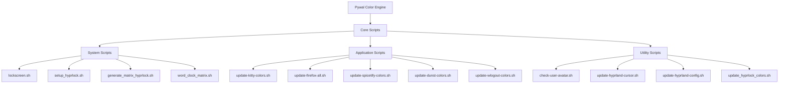
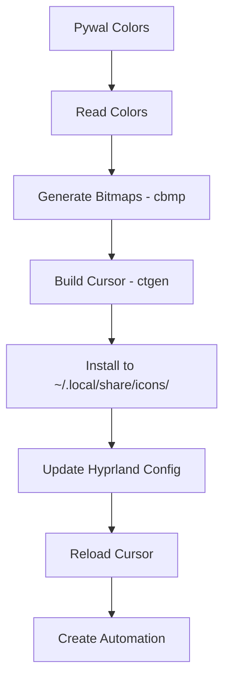

# 🔧 Documentación Completa de Scripts

> **Guía detallada de todos los scripts del sistema de rice Hyprland + Arch Linux**

## 📋 Índice

- [🏗️ Arquitectura de Scripts](#️-arquitectura-de-scripts)
- [🔒 Scripts de Sistema de Bloqueo](#-scripts-de-sistema-de-bloqueo)
- [🖱️ Scripts de Cursor Dinámico](#️-scripts-de-cursor-dinámico)
- [🎨 Scripts de Tematización](#-scripts-de-tematización)
- [📱 Scripts de Aplicaciones](#-scripts-de-aplicaciones)
- [🔧 Scripts de Configuración](#-scripts-de-configuración)
- [🧪 Scripts de Verificación](#-scripts-de-verificación)
- [⚡ Scripts de Automatización](#-scripts-de-automatización)
- [📚 API y Funciones Comunes](#-api-y-funciones-comunes)

## 🏗️ Arquitectura de Scripts



### 📁 **Estructura de Directorios**

```
~/Rice/Scripts/
├── 🔒 Sistema de Bloqueo
│   ├── lockscreen.sh                    # Bloqueo básico con captura
│   ├── setup_hyprlock.sh               # Configuración inicial completa
│   ├── generate_matrix_hyprlock.sh     # Generador de tema Matrix
│   ├── word_clock_matrix.sh            # Reloj de palabras animado
│   └── update_hyprlock_colors.sh       # Actualizador de colores
│
├── 🖱️ Cursor Dinámico
│   └── update-hyprland-cursor.sh       # Sistema completo de cursor
│
├── 🎨 Configuración Sistema
│   ├── update-hyprland-config.sh       # Actualizar colores Hyprland
│   └── check-user-avatar.sh            # Verificar avatar usuario
│
├── 📱 Aplicaciones
│   ├── update-kitty-colors.sh          # Terminal Kitty
│   ├── update-dunst-colors.sh          # Notificaciones
│   ├── update-wlogout-colors.sh        # Menú logout
│   ├── update-spicetify-colors.sh      # Spotify
│   ├── update-nvim-colors.sh           # Neovim
│   └── Firefox (múltiples)
│       ├── update-firefox-colors.sh    # Colores principales
│       ├── update-firefox-all.sh       # Todos los CSS
│       ├── update-tabcenter-colors.sh  # TabCenter Reborn
│       ├── update-sideview-colors.sh   # Side View
│       └── update-tcr-colors.sh        # TCR
│
└── 🧪 Utilidades
    └── verify-dependencies.sh          # Verificación sistema
```

## 🔒 Scripts de Sistema de Bloqueo

### 🚀 `setup_hyprlock.sh`

**Propósito**: Configuración inicial completa del sistema de bloqueo Matrix.

#### **Funcionalidades:**
- ✅ Creación de directorios necesarios
- ✅ Configuración de permisos ejecutables
- ✅ Generación de configuración inicial
- ✅ Creación de hook automático de pywal
- ✅ Verificación de avatar de usuario

#### **Uso:**
```bash
cd ~/Rice/Scripts/
./setup_hyprlock.sh
```

#### **Archivos creados:**
- `~/.config/hypr/scripts/word_clock_matrix.sh`
- `~/.config/hypr/scripts/generate_matrix_hyprlock.sh`
- `~/.config/hypr/scripts/update_hyprlock_colors.sh`
- `~/.config/wal/templates/hyprlock-matrix-update.sh` (hook automático)

#### **Características especiales:**
```bash
# Hook automático que se ejecuta cuando pywal cambia wallpaper
cat ~/.config/wal/templates/hyprlock-matrix-update.sh
```

#### **Salida del script:**
```
🚀 Configurando Matrix lock screen mejorado...
✅ Avatar de usuario encontrado en ~/.face
✅ ¡Configuración Matrix mejorada completada!

🎯 Para usar:
   1. Ejecuta: wal -i /ruta/a/tu/wallpaper.jpg
   2. Los colores se actualizarán automáticamente
   3. Prueba hyprlock para ver el resultado
```

---

### 🎨 `generate_matrix_hyprlock.sh`

**Propósito**: Genera la configuración completa de hyprlock con tema Matrix.

#### **Características del tema Matrix:**
- 🌟 **Reloj de palabras**: Matriz de 11x11 con palabras resaltadas
- 🖼️ **Avatar usuario**: Soporte para `~/.face` personalizada
- 🎨 **Efectos visuales**: Blur, sombras, animaciones
- 🎯 **Orden visual**: Imagen → Reloj → Contraseña

#### **Estructura generada:**
```toml
# hyprlock.conf
general {
    disable_loading_bar = true
    grace = 2
    hide_cursor = true
}

background {
    path = $wallpaper
    blur_passes = 4
    blur_size = 10
}

# 1. IMAGEN DE USUARIO (arriba)
image {
    path = ~/.face
    size = 120
    position = 0, 290
}

# 2. RELOJ DE PALABRAS MATRIZ (centro)
label {
    text = cmd[update:500] ~/.config/hypr/scripts/word_clock_matrix.sh
    font_size = 22
    position = 0, 0
}

# 3. CAMPO DE CONTRASEÑA (abajo)
input-field {
    size = 400, 55
    position = 0, -250
}
```

#### **Colores dinámicos:**
- Usa todos los colores de pywal (color0-color8)
- Actualización automática con cambio de wallpaper
- Fallback a colores por defecto si pywal no está disponible

---

### ⏰ `word_clock_matrix.sh`

**Propósito**: Script del reloj de palabras que se ejecuta cada 500ms.

#### **Características técnicas:**
- 🕐 **Actualización**: Cada 500ms vía `cmd[update:500]`
- 📐 **Matriz**: 11 filas × 11 columnas
- 🎨 **Colores**: Palabras activas vs atenuadas
- 🔤 **Formato**: 12 horas con casos especiales

#### **Matriz de palabras:**
```
I T L I S A S T I M E
A C Q U A R T E R D C
T W E N T Y F I V E X
H A L F B T E N F T O
P A S T E R U N I N E
O N E S I X T H R E E
F O U R F I V E T W O
E I G H T E L E V E N
S E V E N T W E L V E
T E N S E O C L O C K
M I D N I G H T D A Y
```

#### **Lógica de tiempo:**
```bash
# Ejemplo: 3:25 PM
# Palabras activas: "IT IS TWENTY FIVE PAST THREE"
active_words=("IT" "IS" "TWENTY" "FIVE_MIN" "PAST" "THREE")
```

#### **Casos especiales:**
- 🌙 **Medianoche**: "IT IS MIDNIGHT"
- 🕐 **En punto**: "IT IS [HOUR] OCLOCK"
- ⏰ **Media hora**: "IT IS HALF PAST [HOUR]"

#### **Output HTML:**
```html
<span foreground="#color6" font_weight="bold">I</span>
<span foreground="#color8" alpha="30%">T</span>
<!-- Cada carácter con su estilo -->
```

---

### 🔄 `update_hyprlock_colors.sh`

**Propósito**: Actualiza solo los colores de hyprlock manteniendo la configuración.

#### **Funcionamiento:**
```bash
# 1. Cargar colores de pywal
source ~/.cache/wal/colors.sh

# 2. Generar nueva configuración con colores actualizados
cat >~/.config/hypr/hyprlock.conf <<EOF
# Configuración con colores actuales
background {
    color = rgb(${background#\#})
}
# ... resto de configuración
EOF
```

#### **Características:**
- ✅ Mantiene configuración de layout
- ✅ Actualiza solo colores
- ✅ Preserva configuraciones personalizadas
- ✅ Fallback a colores por defecto

---

### 📸 `lockscreen.sh`

**Propósito**: Script básico de bloqueo con captura de pantalla.

#### **Funcionamiento:**
```bash
#!/bin/bash
# Ejecutar Hyprlock para bloquear
hyprlock &
# Esperar un momento para asegurarse de que la pantalla de bloqueo se haya mostrado
sleep 4
# Capturar la pantalla usando grim
grim /home/h3n/lock.png
```

#### **Uso:**
- 🧪 **Testing**: Ver cómo se ve el lock screen
- 📷 **Capturas**: Generar screenshots automáticas
- 🐛 **Debug**: Verificar funcionamiento

## 🖱️ Scripts de Cursor Dinámico

### 🎨 `update-hyprland-cursor.sh`

**Propósito**: Sistema completo de generación de cursor personalizado con colores de pywal.

#### **Arquitectura completa:**


#### **Funciones principales:**

##### 🔍 **check_dependencies()**
```bash
check_dependencies() {
    local missing_deps=()
    
    # Verificar cbmp
    if ! command -v cbmp &>/dev/null; then
        missing_deps+=("cbmp (cursor-builder)")
    fi
    
    # Verificar ctgen
    if ! command -v ctgen &>/dev/null; then
        missing_deps+=("ctgen (cursor-toolbox)")
    fi
    
    # Verificar archivos de pywal
    if [ ! -f "$PYWAL_COLORS_SCSS" ]; then
        missing_deps+=("pywal colors")
    fi
    
    # Mostrar resultados
    if [ ${#missing_deps[@]} -gt 0 ]; then
        print_error "Dependencias faltantes:"
        for dep in "${missing_deps[@]}"; do
            echo "   - $dep"
        done
        return 1
    fi
    
    print_success "Todas las dependencias están presentes"
    return 0
}
```

##### 🎨 **read_pywal_colors()**
```bash
read_pywal_colors() {
    # Leer colores usando grep y sed
    local background=$(grep '^\$background:' "$PYWAL_COLORS_SCSS" | sed 's/^\$background: *\(#[^;]*\);/\1/')
    local foreground=$(grep '^\$foreground:' "$PYWAL_COLORS_SCSS" | sed 's/^\$foreground: *\(#[^;]*\);/\1/')
    local color1=$(grep '^\$color1:' "$PYWAL_COLORS_SCSS" | sed 's/^\$color1: *\(#[^;]*\);/\1/')
    local color2=$(grep '^\$color2:' "$PYWAL_COLORS_SCSS" | sed 's/^\$color2: *\(#[^;]*\);/\1/')
    
    # Asignar a variables globales
    BORDER_COLOR="$color1"    # Color del borde
    OUTLINE_COLOR="$color2"   # Color del contorno
    WATCH_COLOR="$cursor"     # Color de animación de carga
}
```

##### 🔨 **generate_cursor()**
```bash
generate_cursor() {
    # Cambiar al directorio de trabajo
    cd "$BIBATA_CURSOR_DIR" || exit 1
    
    # Limpiar instalaciones anteriores
    rm -rf ~/.local/share/icons/Bibata-Wal
    rm -rf ~/.icons/Bibata-Wal
    
    # Ejecutar cbmp para generar bitmaps
    npx cbmp -d 'svg/modern' -o "bitmaps/$CURSOR_NAME" \
        -bc "$BORDER_COLOR" -oc "$OUTLINE_COLOR" -wc "$WATCH_COLOR"
    
    # Ejecutar ctgen para construir el cursor
    ctgen build.toml -d "bitmaps/$CURSOR_NAME" -n "$CURSOR_NAME" \
        -c "Bibata cursores con colores de pywal."
}
```

##### ⚙️ **update_hyprland_config()**
```bash
update_hyprland_config() {
    # Buscar y actualizar la línea del cursor
    if grep -q "env = XCURSOR_THEME," "$HYPRLAND_CONFIG"; then
        # Actualizar línea existente
        sed -i "s/^env = XCURSOR_THEME,.*/env = XCURSOR_THEME,$CURSOR_NAME/" "$HYPRLAND_CONFIG"
    else
        # Agregar nueva configuración
        echo -e "\n# Cursor" >> "$HYPRLAND_CONFIG"
        echo "env = XCURSOR_THEME,$CURSOR_NAME" >> "$HYPRLAND_CONFIG"
        echo "env = XCURSOR_SIZE,24" >> "$HYPRLAND_CONFIG"
        echo "env = HYPRCURSOR_SIZE,24" >> "$HYPRLAND_CONFIG"
    fi
}
```

##### 🔄 **reload_cursor()**
```bash
reload_cursor() {
    # Verificar que estamos en Hyprland
    if [ -n "$HYPRLAND_INSTANCE_SIGNATURE" ]; then
        # Recargar configuración
        hyprctl reload
        
        # Actualizar variables de entorno
        hyprctl setenv XCURSOR_THEME "$CURSOR_NAME"
        hyprctl setenv XCURSOR_SIZE 24
        hyprctl setenv HYPRCURSOR_SIZE 24
    fi
}
```

#### **Scripts de automatización creados:**

##### 📋 **create_automation_script()**
```bash
# Crea ~/.local/bin/update-cursor-pywal
# Script que se puede llamar desde cualquier lugar
```

##### 🔗 **Pywal Hook**
```bash
# ~/.config/wal/templates/update-cursor.sh
# Se ejecuta automáticamente cuando cambias wallpaper
```

#### **Opciones de línea de comandos:**
```bash
# Verificar dependencias solamente
./update-hyprland-cursor.sh --check

# Ejecutar sin hacer cambios (dry-run)
./update-hyprland-cursor.sh --dry-run

# Mostrar ayuda
./update-hyprland-cursor.sh --help

# Ejecutar normalmente
./update-hyprland-cursor.sh
```

#### **Archivos de configuración utilizados:**

##### 📄 **build.toml** (Bibata Cursor)
```toml
[theme]
name = 'Bibata-Wal'
comment = 'Bibata is open source, compact, and material designed cursor set.'

[config]
out_dir = '/home/h3n/.icons/'
platforms = 'x11'

[cursors]
[cursors.fallback_settings]
x11_sizes = [16, 20, 22, 24, 28, 32, 40, 48, 56, 64, 72, 80, 88, 96]
```

#### **Problemas comunes y soluciones:**

##### ❌ **Cursor no se aplica**
```bash
# Verificar variables de entorno
echo $XCURSOR_THEME
echo $XCURSOR_SIZE

# Verificar instalación
ls ~/.local/share/icons/Bibata-Wal/

# Forzar recarga
hyprctl reload
```

##### ❌ **cbmp o ctgen fallan**
```bash
# Verificar PATH
echo $PATH | grep "/.local/bin"
echo $PATH | grep "/.cargo/bin"

# Reinstalar herramientas
npm install -g cbmp
cargo install ctgen
```

## 🎨 Scripts de Tematización

### ⚙️ `update-hyprland-config.sh`

**Propósito**: Actualizar colores de la configuración principal de Hyprland.

#### **Colores actualizados:**
```bash
# Convierte color #xxxxxx a rgba(xxxxxxff)
hex_to_rgba() {
    local hex="$1"
    echo "rgba(${hex:1}ff)"
}

BORDER_ACTIVE=$(hex_to_rgba "$color4")      # Borde ventana activa
BORDER_INACTIVE=$(hex_to_rgba "$color1")    # Borde ventana inactiva
SHADOW_COLOR=$(hex_to_rgba "$color0")       # Color sombra activa
SHADOW_COLOR_INACTIVE=$(hex_to_rgba "$color8") # Color sombra inactiva
```

#### **Actualización con sed:**
```bash
sed -i \
  -e "s/^\(\s*col.active_border\s*=\s*\).*$/\1$BORDER_ACTIVE/" \
  -e "s/^\(\s*col.inactive_border\s*=\s*\).*$/\1$BORDER_INACTIVE/" \
  -e "s/^\(\s*color\s*=\s*\).*$/\1$SHADOW_COLOR/" \
  -e "s/^\(\s*color_inactive\s*=\s*\).*$/\1$SHADOW_COLOR_INACTIVE/" \
  "$CONFIG"
```

#### **Validación:**
- ✅ Verifica que pywal existe
- ✅ Verifica que hyprland.conf existe
- ✅ Valida que los colores no estén vacíos
- ✅ Aborta si falta información crítica

---

### 👤 `check-user-avatar.sh`

**Propósito**: Verificar y guiar la configuración del avatar de usuario.

#### **Verificaciones:**
```bash
USER_FACE="$HOME/.face"

if [ -f "$USER_FACE" ]; then
    echo "✅ Avatar de usuario encontrado en ~/.face"
    file "$USER_FACE"
    
    # Si ImageMagick está disponible, mostrar detalles
    if command -v identify &>/dev/null; then
        identify "$USER_FACE"
    fi
else
    echo "❌ No se encontró avatar en ~/.face"
    echo "📋 Para agregar tu avatar:"
    echo "   1. Copia tu foto de perfil a ~/.face"
    echo "   2. Formatos recomendados: PNG, JPG (imagen cuadrada funciona mejor)"
    echo "   3. Tamaño recomendado: 200x200 píxeles o mayor"
    echo ""
    echo "Comandos de ejemplo:"
    echo "   cp /ruta/a/tu/foto.jpg ~/.face"
    echo "   wget -O ~/.face 'https://github.com/tuusuario.png'"
fi
```

#### **Recomendaciones:**
- 📐 **Tamaño**: 200x200 píxeles o mayor
- 🖼️ **Formato**: PNG, JPG (PNG recomendado)
- 📏 **Aspecto**: Imagen cuadrada funciona mejor
- 🎯 **Ubicación**: Siempre `~/.face`

## 📱 Scripts de Aplicaciones

### 💻 `update-kitty-colors.sh`

**Propósito**: Configuración completa del terminal Kitty con colores de pywal.

#### **Estructura de configuración:**

##### 🔤 **Configuración de fuentes:**
```bash
echo "# === CONFIGURACIÓN DE FUENTES ==="
echo "font_family JetBrains Mono Nerd Font"
echo "bold_font JetBrains Mono Nerd Font Bold"
echo "italic_font JetBrains Mono Nerd Font Italic"
echo "bold_italic_font JetBrains Mono Nerd Font Bold Italic"
echo "font_size 12.0"
echo "adjust_line_height 110%"
```

##### 🎨 **Colores de pywal:**
```bash
echo "# === COLORES DE PYWAL ==="
cat "$PYWAL_COLORS_FILE"  # ~/.cache/wal/colors-kitty.conf
```

##### 🖥️ **Configuración de ventana:**
```bash
echo "# === CONFIGURACIÓN DE VENTANA ==="
echo "window_padding_width 8"
echo "window_margin_width 0"
echo "window_border_width 1"
echo "background_opacity 0.95"
```

##### ⌨️ **Keybinds personalizados:**
```bash
echo "# === ATAJOS DE TECLADO PERSONALIZADOS ==="
echo "kitty_mod ctrl+shift"
echo "map kitty_mod+c copy_to_clipboard"
echo "map kitty_mod+v paste_from_clipboard"
echo "map kitty_mod+enter new_window"
echo "map kitty_mod+t new_tab"
# ... más keybinds
```

#### **Características incluidas:**
- ✅ Fuentes Nerd Font completas
- ✅ Soporte para emojis y símbolos
- ✅ Configuración de tabs y ventanas
- ✅ Transparencia configurable
- ✅ Keybinds completos para productividad
- ✅ Scrollback y configuración de mouse

#### **Recarga automática:**
```bash
# Notifica a todas las instancias de kitty para recargar
if command -v kitty &>/dev/null; then
    kitty @ load-config &>/dev/null || true
fi
```

---

### 🔔 `update-dunst-colors.sh`

**Propósito**: Configuración avanzada del sistema de notificaciones con colores adaptativos.

#### **Mapeo de colores:**
```bash
# Colores con transparencia (RGBA)
BG="${color0}cc"        # Fondo general (80% opaco)
FG="$color7"            # Texto general
FRAME="${color1}cc"     # Borde (80% opaco)
HL="$color4"            # Highlight (barra de progreso)

# Por urgencia
LOW_BG="${color0}cc"    # Urgencia baja
NORM_BG="${color0}cc"   # Urgencia normal
CRIT_BG="${color1}cc"   # Urgencia crítica
```

#### **Configuración avanzada:**
```bash
# Estilos y dimensiones
FONT="JetBrains Mono 10"
ICON_POSITION="left"
ICON_SIZE="48"
CORNER_RADIUS="10"
PROGRESS_BAR="true"
PROGRESS_BAR_HEIGHT="8"
GEOMETRY="400x5-30+30"  # ancho x cantidad -offsetX +offsetY
```

#### **Soporte para iconos:**
```bash
ICON_PATH="/usr/share/icons/Papirus/32x32/status/:/usr/share/icons/hicolor/32x32/status/:/usr/share/icons/Adwaita/32x32/status/:/usr/share/pixmaps/"
```

#### **Reglas específicas por aplicación:**
```bash
# Regla personalizada para Spotify
[rule]
    appname = "Spotify"
    urgency = low
    background = "#1db954cc"
    foreground = "#ffffff"
    frame_color = "#191414cc"
    icon_position = off
    timeout = 6
```

#### **Configuración por urgencia:**
- 🟢 **Low**: Timeout 4s, colores suaves
- 🟡 **Normal**: Timeout 8s, colores estándar
- 🔴 **Critical**: Timeout 0 (permanente), colores de alerta, sonido

---

### 🚪 `update-wlogout-colors.sh`

**Propósito**: Configuración completa del menú de logout para Hyprland con CSS puro.

#### **Estructura del sistema:**

##### 📋 **Layout JSON:**
```json
{
  "label" : "lock",
  "action" : "hyprlock",
  "text" : "Lock",
  "keybind" : "l"
},
{
  "label" : "logout",
  "action" : "hyprctl dispatch exit",
  "text" : "Logout",
  "keybind" : "e"
}
```

##### 🎨 **CSS con propiedades GTK oficiales:**
```css
/* Variables de colores pywal */
@define-color pywal_background #282828;
@define-color pywal_foreground #ebdbb2;
@define-color pywal_color1 #cc241d;

/* Botones base */
button {
    background-color: alpha(@pywal_color0, 0.85);
    border-style: solid;
    border-width: 2px;
    border-radius: 16px;
    border-color: alpha(@pywal_color1, 0.6);
    min-height: 140px;
    min-width: 140px;
    transition-property: all;
    transition-duration: 250ms;
}

/* Estados de botones */
button:hover {
    background-color: alpha(@pywal_color1, 0.9);
    border-color: @pywal_color2;
    box-shadow: 0px 4px 12px alpha(@pywal_color1, 0.4);
}
```

#### **Comandos específicos para Hyprland:**
- 🔒 **Lock**: `hyprlock`
- 🚪 **Logout**: `hyprctl dispatch exit`
- 😴 **Suspend**: `systemctl suspend`
- 🔄 **Reboot**: `systemctl reboot`
- ⚡ **Shutdown**: `systemctl poweroff`
- 🌙 **Hibernate**: `systemctl hibernate`

#### **Archivos generados:**
- `~/.config/wlogout/layout` - Configuración de botones
- `~/.config/wlogout/style.css` - Estilos visuales
- `~/.config/wlogout/launch-wlogout.sh` - Script de lanzamiento
- `~/.config/wlogout/wlogout-aliases.sh` - Aliases útiles
- `~/.config/wlogout/README.md` - Documentación específica

#### **Características CSS:**
- ✅ Solo propiedades GTK oficiales
- ✅ Variables de color con `@define-color`
- ✅ Funciones GTK: `alpha()`, `shade()`
- ✅ Pseudo-clases: `:hover`, `:active`, `:focus`, `:disabled`
- ✅ Animaciones con `@keyframes`
- ✅ Gradientes con `linear-gradient`

---

### 🎵 `update-spicetify-colors.sh`

**Propósito**: Sistema completo de tematización de Spotify con Spicetify.

#### **Arquitectura del tema:**

##### 📄 **color.ini - Configuración principal:**
```ini
[pywal]
# Colores principales de Spicetify
text               = ebdbb2
subtext            = a89984
main               = 282828
main-elevated      = 3c3836
highlight          = 504945
sidebar            = 1d2021
player             = 1d2021
card               = 3c3836
button             = 98971a
button-active      = b8bb26
notification-error = cc241d

# Colores extendidos basados en pywal
rosewater          = d3869b
flamingo           = fb4934
pink               = d3869b
mauve              = b16286
red                = cc241d
peach              = fe8019
yellow             = fabd2f
green              = 98971a
teal               = 8ec07c
blue               = 458588
sapphire           = 83a598
sky                = 7daea3
lavender           = a89984
```

##### 🎨 **user.css - Estilos personalizados:**
```css
/* Variables CSS personalizadas */
:root {
    --pywal-background: #282828;
    --pywal-foreground: #ebdbb2;
    --pywal-color1: #cc241d;
    --pywal-color2: #98971a;
}

/* Barra de progreso personalizada */
.progress-bar {
    background: linear-gradient(90deg, var(--pywal-color1), var(--pywal-color4)) !important;
    border-radius: 4px !important;
}

/* Botones con gradiente */
.Button--style-green {
    background: linear-gradient(135deg, var(--pywal-color2), var(--pywal-color4)) !important;
    transition: all 0.3s ease !important;
}

/* Sidebar con glassmorphism */
.Root__nav-bar {
    background: rgba(40, 40, 40, 0.85) !important;
    backdrop-filter: blur(10px) !important;
}
```

#### **Funciones auxiliares:**

##### 🎨 **Manipulación de colores:**
```bash
# Generar color más claro
lighten_color() {
    local hex="$1"
    local factor="${2:-20}"
    # Convertir hex a RGB y aumentar brillo
}

# Generar color más oscuro
darken_color() {
    local hex="$1"
    local factor="${2:-20}"
    # Convertir hex a RGB y reducir brillo
}

# Convertir hex a RGB para CSS
hex_to_rgb() {
    local hex="$1"
    # Retorna "r, g, b"
}
```

#### **Sistema de aplicación:**
```bash
apply_spicetify_theme() {
    # Configurar tema
    spicetify config current_theme pywal
    
    # Aplicar cambios
    if spicetify apply; then
        echo "✅ Tema aplicado exitosamente"
    else
        # Fallback con backup y restore
        spicetify backup apply
    fi
}
```

#### **Scripts auxiliares creados:**

##### 🚀 **apply-theme.sh:**
```bash
#!/bin/bash
spicetify config current_theme pywal
spicetify apply
```

##### ⚡ **spicetify-aliases.sh:**
```bash
alias spicetify-update='~/Rice/Scripts/update-spicetify-colors.sh'
alias spicetify-apply='spicetify apply'
alias spicetify-reload='spicetify apply'

spicetify-edit() {
    if [ "$1" = "colors" ]; then
        ${EDITOR:-nano} ~/.config/spicetify/Themes/pywal/color.ini
    elif [ "$1" = "css" ]; then
        ${EDITOR:-nano} ~/.config/spicetify/Themes/pywal/user.css
    fi
}
```

#### **Efectos visuales incluidos:**
- 🌈 **Gradientes**: En botones y barras de progreso
- 💎 **Glassmorphism**: Sidebar con blur
- 🃏 **Cards**: Sombras personalizadas
- 📜 **Scrollbar**: Tematizada con gradientes
- ✨ **Animaciones**: Transiciones suaves en hover
- 🎵 **Now Playing**: Barra inferior con gradiente

---

### 🌐 Scripts de Firefox

#### 🎨 `update-firefox-colors.sh`

**Propósito**: Actualizar colores principales del tema Cascade de Firefox.

##### **Mapeo de colores:**
```bash
# Colores de identidad (container tabs)
IDENTITY_BLUE="$color4"
IDENTITY_TURQUOISE="$color6"
IDENTITY_GREEN="$color2"
IDENTITY_YELLOW="$color3"
IDENTITY_ORANGE="$color5"
IDENTITY_RED="$color1"
IDENTITY_PINK="$color7"
IDENTITY_PURPLE="$color0"

# Colores principales
BASE_COLOR="$color0"
HIGHLIGHT_COLOR="$color8"
INVERTED_COLOR="$color7"
ACCENT_COLOR="$IDENTITY_PURPLE"
```

##### **Archivo objetivo:**
`~/.mozilla/firefox/*/chrome/includes/cascade-colours.css`

##### **Actualización con sed:**
```bash
sed -i \
  -e "s|--uc-identity-colour-blue: #[a-fA-F0-9]\{6\}|--uc-identity-colour-blue: $IDENTITY_BLUE|g" \
  -e "s|--uc-identity-colour-turquoise: #[a-fA-F0-9]\{6\}|--uc-identity-colour-turquoise: $IDENTITY_TURQUOISE|g" \
  -e "s|--uc-base-colour: #[a-fA-F0-9]\{6\}|--uc-base-colour: $BASE_COLOR|g" \
  "$FIREFOX_COLORS_FILE"
```

---

#### 📋 `update-tabcenter-colors.sh`

**Propósito**: Actualizar colores de la extensión TabCenter Reborn.

##### **Características específicas:**
- 🗂️ **Pestañas laterales**: Configuración específica para tabs verticales
- 🎨 **Container tabs**: Soporte completo para containers de Firefox
- 🔄 **Sincronización**: Mismos colores que cascade-colours.css

##### **Archivo objetivo:**
`~/.mozilla/firefox/*/chrome/includes/tabcenter-reborn.css`

---

#### 📱 `update-sideview-colors.sh`

**Propósito**: Actualizar colores de la extensión Side View.

##### **Configuración específica:**
```bash
# Mapeo simple para Side View
BASE_COLOR="$color0"
FRAME_COLOR="$color0"

# Actualización específica
sed -i \
  -e "s|background-color: var(--lwt-frame) !important;|background-color: $BASE_COLOR !important;|g" \
  "$SIDEVIEW_FILE_PATH"
```

---

#### 🔧 `update-tcr-colors.sh`

**Propósito**: Actualizar integración TabCenter Reborn (TCR).

##### **Características:**
- 🏗️ **Estructural**: Principalmente cambios de layout
- 🎨 **Minimal**: Pocos cambios de color
- 🔗 **Integración**: Complementa tabcenter-reborn.css

---

#### 🌐 `update-firefox-all.sh`

**Propósito**: Ejecutar todos los scripts de Firefox en secuencia.

```bash
#!/bin/bash
echo "🎨 Actualizando todos los archivos CSS de Firefox con pywal..."

scripts=(
    "update-firefox-colors.sh"      # 1️⃣ Colores principales
    "update-tabcenter-colors.sh"    # 2️⃣ TabCenter Reborn
    "update-sideview-colors.sh"     # 3️⃣ Side View
    "update-tcr-colors.sh"          # 4️⃣ TabCenter Reborn TCR
)

for script in "${scripts[@]}"; do
    echo "Ejecutando: $script"
    ./"$script"
done

echo "✅ Todos los archivos CSS de Firefox han sido actualizados"
echo "💡 Reinicia Firefox para aplicar todos los cambios"
```

---

### 📝 `update-nvim-colors.sh`

**Propósito**: Integración de Neovim con Catppuccin y colores de pywal.

#### **Configuración generada:**
```lua
{
    "catppuccin/nvim",
    name = "catppuccin",
    priority = 1000,
    opts = {
        flavour = "mocha",
        color_overrides = {
            mocha = {
                base = "#282828",     -- background
                mantle = "#282828",   -- background
                text = "#ebdbb2",     -- foreground
                
                surface0 = "#cc241d", -- color1
                surface1 = "#98971a", -- color2
                surface2 = "#d79921", -- color3
                
                blue = "#458588",     -- color4
                mauve = "#b16286",    -- color5
                teal = "#689d6a",     -- color6
                yellow = "#d79921",   -- color7
            },
        },
        integrations = {
            cmp = true,
            gitsigns = true,
            nvimtree = true,
            treesitter = true,
            notify = true,
            telescope = { enabled = true },
            which_key = true,
            -- ... más integraciones
        },
    },
},
```

#### **Características:**
- ✅ **Base Catppuccin**: Usa Catppuccin Mocha como base
- ✅ **Color overrides**: Reemplaza colores con pywal
- ✅ **Integraciones**: Soporte para plugins populares
- ✅ **Actualización automática**: Se recarga con cambio de wallpaper

## 🔧 Scripts de Configuración

### 🧪 **Scripts de Verificación y Mantenimiento**

#### 🔍 `verify-dependencies.sh` (generado dinámicamente)

**Propósito**: Verificación completa del estado del sistema.

```bash
#!/bin/bash
echo "🔍 Verificando dependencias del sistema..."

# Función para verificar comando
check_command() {
    if command -v "$1" &> /dev/null; then
        echo "✅ $1 - instalado"
        return 0
    else
        echo "❌ $1 - NO instalado"
        return 1
    fi
}

# Función para verificar archivo
check_file() {
    if [ -f "$1" ]; then
        echo "✅ $1 - existe"
        return 0
    else
        echo "❌ $1 - NO existe"
        return 1
    fi
}

echo "=== Compositor y Sistema Base ==="
check_command hyprland
check_command hyprlock
check_command wlogout
check_command dunst
check_command rofi

echo -e "\n=== Terminal y Herramientas ==="
check_command kitty
check_command zsh
check_command wal
check_command grim

echo -e "\n=== Aplicaciones ==="
check_command firefox
check_command spotify
check_command spicetify
check_command nvim

echo -e "\n=== Herramientas de Cursor ==="
check_command cbmp
check_command ctgen
check_command npx
check_command cargo

echo -e "\n=== Archivos de Configuración ==="
check_file ~/.config/hypr/hyprland.conf
check_file ~/.cache/wal/colors.sh
check_file ~/.face

echo -e "\n=== Directorios del Rice ==="
check_file ~/Rice/Scripts/setup_hyprlock.sh
check_file ~/Rice/Wallpapers/imagen_001.png
check_file ~/Rice/Bibata_Cursor/build.toml

echo -e "\n=== Servicios ==="
if systemctl --user is-active pipewire.service &> /dev/null; then
    echo "✅ PipeWire - activo"
else
    echo "❌ PipeWire - inactivo"
fi

if pgrep -x "Hyprland" > /dev/null; then
    echo "✅ Hyprland - ejecutándose"
else
    echo "❌ Hyprland - no ejecutándose"
fi

echo -e "\n🎯 Verificación completada!"
```

## ⚡ Scripts de Automatización

### 🔄 **Hooks Automáticos de Pywal**

#### 📍 **Ubicación**: `~/.config/wal/templates/`

Todos los scripts principales crean hooks automáticos que se ejecutan cuando pywal cambia el wallpaper:

##### 🔒 **hyprlock-matrix-update.sh**
```bash
#!/bin/bash
# Hook automático de pywal - se ejecuta después de cambiar wallpaper
echo "🎨 Pywal detectado - actualizando colores Matrix lock..."
~/.config/hypr/scripts/generate_matrix_hyprlock.sh
echo "✅ ¡Colores Matrix lock screen actualizados!"
```

##### 🖱️ **update-cursor.sh**
```bash
#!/bin/bash
# Hook automático para pywal - actualiza cursor cuando cambias wallpaper

# Esperar un poco para que pywal termine de generar los archivos
sleep 2

# Ejecutar actualización de cursor
if [ -f ~/.local/bin/update-cursor-pywal ]; then
    bash ~/.local/bin/update-cursor-pywal &
fi
```

### 🚀 **Scripts de Lanzamiento**

#### 📋 **update-all-colors.sh** (crear manualmente)
```bash
#!/bin/bash
# Script maestro para actualizar todos los componentes

cd ~/Rice/Scripts/

echo "🎨 Actualizando todos los colores del sistema..."

# Array de scripts a ejecutar
scripts=(
    "update_hyprlock_colors.sh"
    "update-hyprland-config.sh"
    "update-hyprland-cursor.sh"
    "update-kitty-colors.sh"
    "update-dunst-colors.sh"
    "update-wlogout-colors.sh"
    "update-spicetify-colors.sh"
    "update-firefox-all.sh"
    "update-nvim-colors.sh"
)

# Ejecutar cada script
for script in "${scripts[@]}"; do
    if [ -f "$script" ]; then
        echo "⚙️ Ejecutando: $script"
        ./"$script"
        if [ $? -eq 0 ]; then
            echo "✅ $script completado"
        else
            echo "❌ Error en $script"
        fi
    else
        echo "⚠️ Script no encontrado: $script"
    fi
done

# Recargar servicios necesarios
echo "🔄 Recargando servicios..."
killall dunst && dunst &
hyprctl reload

echo "✅ ¡Todos los colores actualizados exitosamente!"
```

## 📚 API y Funciones Comunes

### 🔧 **Funciones Compartidas**

#### 🎨 **Manejo de Colores**
```bash
# Cargar colores de pywal
load_pywal_colors() {
    local colors_file="$HOME/.cache/wal/colors.sh"
    if [ -f "$colors_file" ]; then
        source "$colors_file"
        return 0
    else
        echo "❌ Error: No se encontró archivo de colores de pywal"
        return 1
    fi
}

# Convertir hex a rgba
hex_to_rgba() {
    local hex="$1"
    local alpha="${2:-ff}"
    echo "rgba(${hex:1}${alpha})"
}

# Verificar que los colores no estén vacíos
validate_colors() {
    local required_colors=("background" "foreground" "color0" "color1" "color2" "color3" "color4")
    for color in "${required_colors[@]}"; do
        if [ -z "${!color}" ]; then
            echo "❌ Error: Color $color está vacío"
            return 1
        fi
    done
    return 0
}
```

#### 🛠️ **Utilidades de Sistema**
```bash
# Verificar que estamos en Hyprland
check_hyprland() {
    if [ -n "$HYPRLAND_INSTANCE_SIGNATURE" ]; then
        return 0
    else
        echo "⚠️ No se detectó Hyprland"
        return 1
    fi
}

# Crear backup de archivo
create_backup() {
    local file="$1"
    local backup_dir="$(dirname "$file")/backup"
    local backup_file="$backup_dir/$(basename "$file").bak.$(date +%Y%m%d%H%M%S)"
    
    mkdir -p "$backup_dir"
    cp "$file" "$backup_file"
    echo "🗂️ Backup creado: $backup_file"
}

# Verificar dependencias
check_dependencies() {
    local deps=("$@")
    local missing=()
    
    for dep in "${deps[@]}"; do
        if ! command -v "$dep" &> /dev/null; then
            missing+=("$dep")
        fi
    done
    
    if [ ${#missing[@]} -gt 0 ]; then
        echo "❌ Dependencias faltantes: ${missing[*]}"
        return 1
    fi
    
    return 0
}
```

#### 🖨️ **Funciones de Output**
```bash
# Funciones para mensajes con colores
print_status() {
    echo "🎨 $1"
}

print_success() {
    echo "✅ $1"
}

print_error() {
    echo "❌ $1"
}

print_warning() {
    echo "⚠️ $1"
}

print_info() {
    echo "💡 $1"
}
```

### 📋 **Plantilla de Script Estándar**

```bash
#!/bin/bash

# --------------------------------------------------------------
# Proyecto creado por hen-x
# GitHub: https://github.com/hen-x
# --------------------------------------------------------------

# Configuración de rutas
SCRIPT_NAME="$(basename "$0")"
SCRIPT_DIR="$(cd "$(dirname "${BASH_SOURCE[0]}")" && pwd)"
PYWAL_COLORS_SH="$HOME/.cache/wal/colors.sh"

# Funciones de utilidad
source_pywal_colors() {
    if [ -f "$PYWAL_COLORS_SH" ]; then
        source "$PYWAL_COLORS_SH"
        return 0
    else
        echo "❌ Error: No se encontró $PYWAL_COLORS_SH"
        echo "Ejecuta pywal primero con: wal -i /path/to/wallpaper"
        return 1
    fi
}

print_header() {
    echo "🎨 $SCRIPT_NAME - Actualizando colores con pywal..."
}

print_footer() {
    echo "✅ $SCRIPT_NAME completado exitosamente!"
}

# Función principal
main() {
    print_header
    
    # Cargar colores de pywal
    if ! source_pywal_colors; then
        exit 1
    fi
    
    # Tu lógica aquí
    echo "Colores cargados:"
    echo "  Background: $background"
    echo "  Foreground: $foreground"
    
    print_footer
}

# Ejecutar función principal
main "$@"
```

### 🔄 **Patrones de Uso Comunes**

#### 🎨 **Actualización de archivos CSS/Config**
```bash
# Patrón estándar para actualizar archivos de configuración
update_config_file() {
    local config_file="$1"
    local temp_file="/tmp/$(basename "$config_file").tmp"
    
    # Crear backup
    create_backup "$config_file"
    
    # Generar nueva configuración
    generate_config_content > "$temp_file"
    
    # Verificar que se generó correctamente
    if [ -s "$temp_file" ]; then
        mv "$temp_file" "$config_file"
        echo "✅ $config_file actualizado"
    else
        echo "❌ Error generando $config_file"
        rm -f "$temp_file"
        return 1
    fi
}
```

#### 🔄 **Recargar servicios**
```bash
# Patrón para recargar servicios después de actualizar configuración
reload_service() {
    local service="$1"
    local config_updated="$2"
    
    if [ "$config_updated" = "true" ]; then
        case "$service" in
            "dunst")
                killall dunst && dunst &
                echo "🔄 Dunst recargado"
                ;;
            "hyprland")
                if check_hyprland; then
                    hyprctl reload
                    echo "🔄 Hyprland recargado"
                fi
                ;;
            "kitty")
                if command -v kitty &>/dev/null; then
                    kitty @ load-config &>/dev/null || true
                    echo "🔄 Kitty recargado"
                fi
                ;;
        esac
    fi
}
```

---

## 📖 **Resumen de Scripts por Categoría**

### 🔒 **Sistema de Bloqueo (5 scripts)**
- `setup_hyprlock.sh` - Configuración inicial completa
- `generate_matrix_hyprlock.sh` - Generador de tema Matrix
- `word_clock_matrix.sh` - Reloj de palabras animado
- `update_hyprlock_colors.sh` - Actualizador de colores
- `lockscreen.sh` - Bloqueo básico con captura

### 🖱️ **Cursor Dinámico (1 script)**
- `update-hyprland-cursor.sh` - Sistema completo de cursor

### 🎨 **Configuración Sistema (2 scripts)**
- `update-hyprland-config.sh` - Colores de Hyprland
- `check-user-avatar.sh` - Verificación de avatar

### 📱 **Aplicaciones (11 scripts)**
- `update-kitty-colors.sh` - Terminal Kitty
- `update-dunst-colors.sh` - Notificaciones
- `update-wlogout-colors.sh` - Menú logout
- `update-spicetify-colors.sh` - Spotify
- `update-nvim-colors.sh` - Neovim
- `update-firefox-colors.sh` - Firefox principal
- `update-firefox-all.sh` - Todos los CSS Firefox
- `update-tabcenter-colors.sh` - TabCenter Reborn
- `update-sideview-colors.sh` - Side View
- `update-tcr-colors.sh` - TCR

### 🧪 **Utilidades (1+ scripts)**
- `verify-dependencies.sh` - Verificación del sistema
- `update-all-colors.sh` - Actualización masiva (crear manualmente)
- Scripts de diagnóstico y mantenimiento

---

**Total: 20+ scripts funcionando en armonía para crear un sistema de rice completamente automatizado y personalizable.**

---

## 🎯 **Próximos Pasos**

1. **📖 Lee la documentación**: [README.md](README.md) para visión general
2. **📦 Instala dependencias**: [DEPENDENCIES.md](DEPENDENCIES.md) para setup completo
3. **🚀 Sigue la instalación**: [INSTALLATION.md](INSTALLATION.md) para implementación
4. **⚡ Usa los scripts**: Esta documentación para entender funcionamiento
5. **🎨 Personaliza**: Modifica scripts según tus necesidades

---

**Creado por [hen-x](https://github.com/hen-x) • Documentación completa de scripts**
